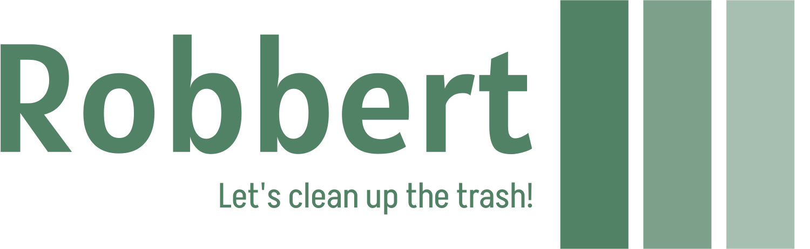

# Robbert

Robbert is a program which is designed to detect 5 cm round balls of either aluminium or paper trash with imaged recognition, pick it up and drop it at a specific point.

## Requirements

The followingen hardware is advised to use with Robbert:
- Raspberry Pi 4b, with [Mirte Software](https://docs.mirte.org/doc/install_mirte_software.html) installed
- USB-webcam, connected to the Raspberry Pi USB 3.0 port
- Raspberry Pi Pico, connected to the Raspberry Pi USB 2.0 port with connected:
  - Servo (2)
  - Sonar sensor
  - Color sensor (2)

## Installation

Step 1. Update the Raspberry Pi

```bash
sudo apt-get update
sudo apt-get dist-upgrade
```

Step 2. Download this repository. This repository comes with a Tensorflow Lite model which is trained to recognize 5 cm balls of paper and aluminium. [This](https://github.com/EdjeElectronics/TensorFlow-Lite-Object-Detection-on-Android-and-Raspberry-Pi) will be a useful guide if you'd like to create your own TensorFlow Lite model.

```bash
git clone https://github.com/Programmeer-Beer/robbert.git
```

Step 3. Install TensorFlow Lite dependencies and OpenCV

```bash
cd robbert
bash get_pi_requirements.sh
```

Step 4. Create a config.py file and make changes to your liking

```bash
cp config.example.py config.py
```

Step 5. Run Robbert

```bash
python3 main.py
```

## Usage

Robbert should work flawlessly, but if you'd like to tinker a bit. Here's an overview of all the functions and what they do.

### robbert

With robbert you will be able to communicate with the Arduino. You can read the sensors and let it move its servo's.

```python
import robbert

robbert.move(advised_movement)
# Move robbert
# Parameters:
#  advised_movement = {
#    'direction': 'forward',  # (str) Directions to choose from are 'forward', 'backword', 'right' and 'left'.
#    'speed': 20.0,  # (float) Speeds between 0 and 100 percent.
#    'duration': 0.5,  # (float) Duration it will move, choose anything greater than 0.

robbert.collision_warning()
# Check for collision
# Use MIN_DISTANCE in config.py to change the moment the warning will come up.
# Returns: 
#   bool: True if collision ahead False if its save to go.

robbert.avoid_collision()
# Robbert will try to avoid the collision by reverting and turning left.
# Use AVOID_COLLISSION_SPEED, AVOID_COLLISSION_BACKWARD_DURATION, AVOID_COLLISSION_TURN_DURATION in config.py to configer.

robbert.grab()
# This will grab the object.

robbert.drop()
# This will drop the object.

robbert.sonar_distance()
# Reads sonar sensor.
# Returns:
#   float: The measured distance in [m].

robbert.check_color()
# Reads color sensors.
# Returns:
# color = {
#   'left': 'black',  # (str) Eighter 'white' or 'black'.
#   'left': 'black',  # (str) Eighter 'white' or 'black'.
# }
```

### object_detection

To use the object detection models you can use object_detection.

```python
import object_detection

object_detection.find_closest()
# Find the closest object near the robot.
# Returns:
#  object_closest = {
#    'material': 'aluminium',  # (str) Materials to choose from are dependend on the model defined in config.py, but in standard configuration the options are 'aluminium' and 'papier'.
#    'xpercentage': 20,  # (round) Screen position left 0% and right 100%.
#    'ypercentage': 20,  # (round) Screen position bottom 0% and top 100%.
```

### calculate

The calculate file will do all the calculations for you. So that you can keep a clear overview.

```python
import calculate

calculate.search_movement(object_closest)
# Creates an advised movement directory to find a object.
# Parameters:
#  object_closest = {
#    'material': 'aluminium',  # (str) Materials to choose from are dependend on the model defined in config.py, but in standard configuration the options are 'aluminium' and 'papier'.
#    'xpercentage': 20,  # (round) Screen position left 0% and right 100%.
#    'ypercentage': 20,  # (round) Screen position bottom 0% and top 100%.
#
# Returns:
#  advised_movement = {
#    'direction': 'forward',  # (str) Directions to choose from are 'forward', 'backword', 'right' and 'left'.
#    'speed': 20.0,  # (float) Speeds between 0 and 100 percent.
#    'duration': 0.5,  # (float) Duration it will move, choose anything greater than 0.
#    'grab': False,  # (bool) If search_movement thinks you can grab the trash it will let you know with this parameter.
#
#  DEVIATION, DISERED_OBJECT_LOCATION, STANDARD_SPEED, CAUTION_LEVEL_Y and CAUTION_LEVEL_X can be changed in config.py to tweek the performance.

calculate.drop_movement(color, desired_color, distance)
# Creates an advised movement directory to drop the object.
# Parameters:
#   color = {  # (dir) Retrieved from the color sensor. 
#     'left': 'black',  # (str) Can either be 'black' or 'white'.
#     'right': 'white',  # (str) Can either be 'black' or 'white'.
#   },
#   desired_color = 'black',  # (str) Can either be 'black' or 'white'.
#   distance = 1.2,  # (float) Distance to Robbert in meters, retrieved from the sonar sensor.
#
# Returns:
#  advised_movement = {
#    'direction': 'forward',  # (str) Directions to choose from are 'forward', 'backword', 'right' and 'left'.
#    'speed': 20.0,  # (float) Speeds between 0 and 100 percent.
#    'duration': 0.5,  # (float) Duration it will move, choose anything greater than 0.
#    'drop': False,  # (bool) If drop_movement thinks you can drop the trash it will let you know with this parameter.
#
#  DEVIATION, STANDARD_SPEED, DROP_DISTANCE, STANDARD_DURATION_SONAR_FORWARD and STANDARD_DURATION_SONAR_TURNING can be changed in config.py to tweek the performance.

```
